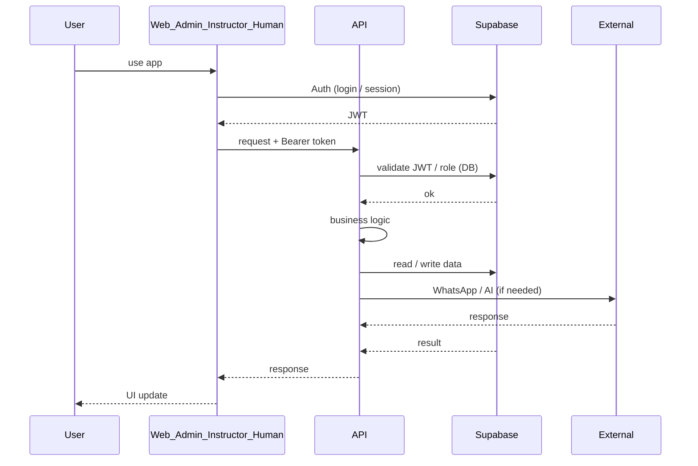

# TA-0 — System Overview

**Status:** Target Architecture (one-page alignment)  
**Scope:** What the system is: main components and responsibilities. No flow detail — see TA-1 through TA-6 for critical flows.

---

## Scope

- **In scope:** Frontends, API, Supabase (Auth + DB), external systems. One diagram; links to flow docs.
- **Out of scope:** Implementation details, data models, failure behaviour (TA-6).

---

## Actors (components)

| Component | Responsibility |
|-----------|----------------|
| **Web** | Admin UI (e.g. Vite). Session via Supabase Auth; calls API with Bearer token; AdminGuard for protected routes. |
| **Instructor app** | Instructor UI (Next.js). Auth via Supabase; owns inbox, bookings, availability, profile. |
| **Admin app** | Alternative admin UI (Next.js). requireAdmin; calls same API admin endpoints. |
| **Human app** | Human inbox / reply UI. Auth and API as needed for human handoff flows. |
| **API** | Fastify. Webhooks (WhatsApp), admin routes (JWT + requireAdminUser), instructor routes (JWT). Single entry for server-side logic. |
| **Supabase** | Auth (JWT issuance/validation). Postgres: conversations, messages, bookings, profiles, channel identity, audit. Source of truth for identity and role (with DB). |
| **External** | WhatsApp (inbound webhooks, outbound send); Stripe (if used); AI (classification, draft generation). |

---

## Trigger

- Users open apps (read/write via API).
- WhatsApp sends webhooks (inbound messages) to API.
- Background or edge flows (e.g. AI orchestration) as implemented.

---

## Happy Path (what exists at high level)

- User signs in (Supabase Auth) → gets JWT → calls API with Bearer token.
- API validates JWT and, for admin, checks role in DB; then serves read/write.
- Inbound WhatsApp → API → resolve conversation, persist message, optional AI draft (TA-3).
- Admin/instructor perform operations (inbox, booking override, send draft) via API (TA-5, TA-4).

---

## Variants

- Multiple frontends (Web, Admin, Instructor, Human) share the same API and Supabase; differentiation is by route and role (TA-2).

---

## Failure Modes

- See [TA-6 — Failure & Degradation](TA-6_FAILURE_AND_DEGRADATION.md). High level: Supabase/API/WhatsApp down or degraded; behaviour and recovery are documented there.

---

## Invariants

- **Single API:** All server-side HTTP and webhook traffic goes through the Fastify API (except Supabase Auth and direct DB where designed).
- **Identity and role:** JWT (Supabase) + DB (profiles/users); backend never trusts client-provided identity or role (TA-1, TA-2).

---

## Source of Truth

- **Identity:** Supabase Auth.
- **Role and app data:** Supabase Postgres (profiles, users, conversations, messages, bookings, etc.).
- **Flow and guardrails:** TA-1–TA-6.

---

## Diagram (Mermaid)

---

## Links

- [TA-1 — Identity & Auth](TA-1_IDENTITY_AND_AUTH.md)
- [TA-2 — Authorization & Roles](TA-2_AUTHORIZATION_AND_ROLES.md)
- [TA-3 — Conversation Lifecycle](TA-3_CONVERSATION_LIFECYCLE.md)
- [TA-4 — Booking Lifecycle](TA-4_BOOKING_LIFECYCLE.md)
- [TA-5 — Admin Operations](TA-5_ADMIN_OPERATIONS.md)
- [TA-6 — Failure & Degradation](TA-6_FAILURE_AND_DEGRADATION.md)
- [ARCHITECTURE_MIN](ARCHITECTURE_MIN.md) (legacy overview; data model and failure notes).
