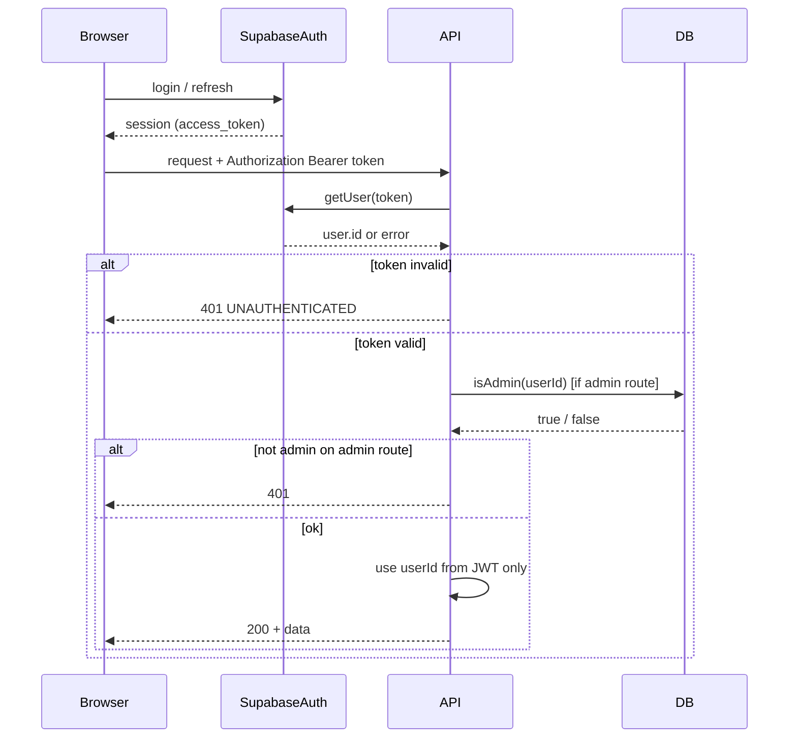

# TA-1 — Identity & Auth Flow

**Status:** Target Architecture (flow control)  
**Scope:** How identity is established and verified. No implementation detail beyond what is needed to explain and audit the flow.

---

## Scope

- **In scope:** Signup, login, session refresh, logout, token scaduto, token mancante, token valido ma ruolo sbagliato (e.g. non-admin su route admin).
- **Out of scope:** Password policy, MFA, OAuth providers (document only that Supabase Auth is the provider).

---

## Actors

| Actor | Role |
|-------|------|
| **Browser** | Web app, Admin app, or Instructor app. Holds Supabase session; sends `Authorization: Bearer <access_token>` to API. |
| **Supabase Auth** | Issues and validates JWTs. Source of identity (who the user is). |
| **API (Fastify)** | Validates JWT on every protected request; never trusts client-provided user id or role. |

---

## Trigger

- User opens a protected page (e.g. admin dashboard) or calls a protected API endpoint.
- Any request to `/admin/*` (except where explicitly public) or `/instructor/*` that requires a known user.

---

## Happy Path (flusso principale)

1. User signs up or logs in via Supabase Auth (UI provided by Supabase or app).
2. Supabase returns a session containing an **access_token** (JWT).
3. Client stores the session (e.g. in memory or secure storage) and sends it on each request as `Authorization: Bearer <access_token>`.
4. For **admin** flows: client may call `GET /admin/check` with the Bearer token. API calls `getUserIdFromJwt(request)` (validates JWT with Supabase `getUser(token)`), then `isAdmin(userId)` against DB. Response is `{ ok: true, isAdmin: true }` or 401.
5. For **admin** mutations/reads: every route calls `requireAdminUser(request)` which: (a) gets userId from JWT via `getUserIdFromJwt`, (b) checks `isAdmin(userId)`. If both succeed, the route uses that userId (never from query/body).
6. Session refresh is handled by Supabase client (e.g. refresh_token). API only ever sees a valid or invalid access_token.

---

## Variants

- **Login:** Supabase Auth; session created; access_token used as above.
- **Logout:** Client clears session; subsequent requests have no token → 401.
- **Session refresh:** Client uses refresh_token to obtain new access_token; no change to API flow (still Bearer token).
- **Admin check:** `GET /admin/check` returns `isAdmin` for the current token; backend ignores any `userId` in query (identity comes only from JWT).
- **Instructor routes:** Use `getUserIdFromJwt(request)` only (no admin check); same identity rule: JWT is the only identity.

---

## Failure Modes

| Case | What happens | HTTP / behaviour |
|------|----------------|------------------|
| Token missing | `getUserIdFromJwt` throws `InstructorAuthError` | 401, `error.code: UNAUTHENTICATED` |
| Token expired / invalid | Supabase `getUser(token)` fails; same throw | 401 |
| Token valid but user not admin (on admin route) | `requireAdminUser` throws after `isAdmin(userId)` false | 401 (Admin access required) |
| Supabase Auth unreachable | `getUser(token)` returns error → 401 | 401 |

---

## Invariants

- **JWT is the only identity.** The backend never uses a user id from query, body, or header other than the one derived from the validated JWT.
- **Backend validates always.** Every protected route validates the token (via Supabase) and, for admin, the role (via DB). No “trust client” path.
- **Client does not decide roles.** The client only sends the token; it may show/hide UI based on `/admin/check`, but access control is enforced by the API using DB-backed role.

---

## Source of Truth

- **Identity (who):** Supabase Auth. Valid JWT → `user.id` (sub) is the unique identity.
- **Role (admin or not):** Database (`profiles.is_admin` or `users.role`). See [TA-2 — Authorization & Roles](TA-2_AUTHORIZATION_AND_ROLES.md).

---

## Diagram (Mermaid)

---

## Links

- [TA-2 — Authorization & Roles](TA-2_AUTHORIZATION_AND_ROLES.md) (role source of truth and enforcement).
- [ARCHITECTURE_MIN](ARCHITECTURE_MIN.md) (system context).
- Implementation: `apps/api/src/lib/auth_instructor.ts` (`getUserIdFromJwt`, `requireAdminUser`); `apps/api/src/routes/admin.ts` (e.g. GET /admin/check).
