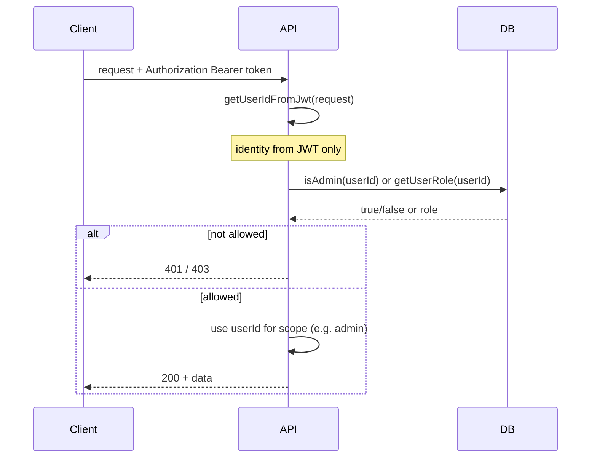

# TA-2 — Authorization & Roles

**Status:** Target Architecture (flow control)  
**Scope:** Who can do what. Pattern: JWT → userId → DB (role) → route enforcement. No implementation detail beyond what is needed to explain and audit.

---

## Scope

- **In scope:** Admin, Instructor, and (if present) Worker or debug user; how role is resolved and enforced on API and frontend.
- **Out of scope:** Granular permissions within a role; feature flags as authorization (see TA-5 for flags as operations).

---

## Actors

| Actor | Role |
|-------|------|
| **API (Fastify)** | Enforces auth and role on every protected route; uses only JWT-derived userId and DB for role. |
| **DB (profiles / users)** | Source of truth for role: `profiles.is_admin`, `profiles.role`; fallback `users.role`. |
| **Frontend (Web Admin)** | AdminGuard: getSession → checkAdminStatus(access_token) → 403 if not admin. Sends Bearer token to API. |
| **Frontend (Admin app)** | requireAdmin: getSession → calls GET /admin/check. Must send `Authorization: Bearer <access_token>`; backend ignores any userId in query. |

---

## Trigger

- Any request to a route that requires a specific role (e.g. all `/admin/*` require admin; `/instructor/*` require authenticated user, optionally instructor role).

---

## Happy Path (flusso principale)

1. Request arrives at API with `Authorization: Bearer <token>`.
2. **Identity:** API obtains userId via `getUserIdFromJwt(request)` (see [TA-1](TA-1_IDENTITY_AND_AUTH.md)). No userId from query or body is used for authorization.
3. **Role (admin routes):** API calls `requireAdminUser(request)`, which: (a) getUserIdFromJwt → userId, (b) `isAdmin(userId)` against DB. Order: `profiles.is_admin` first, then `users.role = 'admin'`.
4. If admin: route proceeds with that userId. If not admin: throw → 401.
5. **Instructor routes:** Use `getUserIdFromJwt(request)` only; no admin check. Role can be checked via `getUserRole(userId)` when needed; `assertRoleAllowed(userId, ['instructor', ...])` for stricter enforcement.

---

## Variants

- **Admin:** All admin routes use `requireAdminUser(request)`. No admin route uses client-provided userId for access control.
- **Instructor:** Same JWT; routes under `/instructor/*` use `getUserIdFromJwt` and may check `getUserRole` or resource ownership (e.g. instructor_id = userId).
- **Debug / dev:** Admin app’s `requireAdmin()` may bypass checks in development (NODE_ENV); production always enforces via API.

---

## Failure Modes

| Case | What happens | Guarantee |
|------|----------------|-----------|
| DB unreachable or query fails in `isAdmin` | `isAdmin` returns false (catch block) | 403-style denial, not 500; fail-closed. |
| Client sends fake role or userId in body/query | Backend ignores it; uses only JWT → userId and DB for role | No privilege escalation. |
| Token valid but user not in profiles/users | `isAdmin` returns false; getUserRole returns null | Treated as not admin / no role. |

---

## Invariants

- **Backend never uses client-provided userId or role for authorization.** Identity from JWT only; role from DB only.
- **Admin enforcement is consistent:** every admin route calls `requireAdminUser(request)` and uses the returned userId.
- **Fail-closed on DB errors:** if role lookup fails, treat as “not admin” (403), not 500.

---

## Source of Truth

- **Identity:** Supabase Auth (JWT). See [TA-1](TA-1_IDENTITY_AND_AUTH.md).
- **Role (admin, instructor, etc.):** Database. Preferred: `profiles.is_admin`, `profiles.role`. Fallback: `users.role`. Implemented in `packages/db/src/admin_access.ts` (`isAdmin`, `getUserRole`, `assertAdminAccess`, `assertRoleAllowed`).

---

## Diagram (Mermaid)

---

## Links

- [TA-1 — Identity & Auth Flow](TA-1_IDENTITY_AND_AUTH.md) (identity and token validation).
- Implementation: `apps/api/src/lib/auth_instructor.ts` (`requireAdminUser`); `apps/api/src/routes/admin.ts` (all routes use requireAdminUser; userId never from query/body). `packages/db/src/admin_access.ts` (`isAdmin`, `getUserRole`, `assertAdminAccess`, `assertRoleAllowed`). Frontend: `apps/web/src/components/AdminGuard.tsx` (getSession → checkAdminStatus with Bearer); `apps/web/src/lib/api.ts` (checkAdminStatus sends Authorization: Bearer). Admin app: `apps/admin/lib/requireAdmin.ts` (must send Bearer to /admin/check; backend ignores query param userId).
