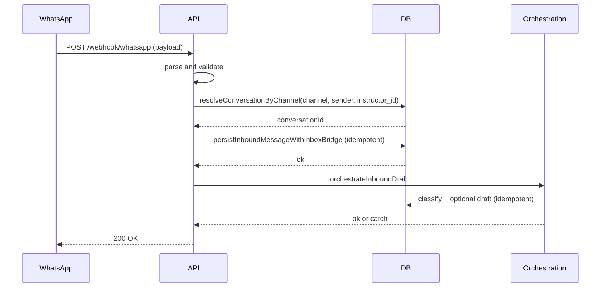

# TA-3 — Conversation Lifecycle

**Status:** Target Architecture (flow control)  
**Scope:** Inbound conversation flow from channel to persistence and AI draft. Who does what, with which source of truth and guardrails.

---

## Scope

- **In scope:** Inbound WhatsApp message ingestion, conversation resolution, message persistence, AI classification and optional draft; handoff to human, booking intent, escalation, AI disabled (gating).
- **Out of scope:** Outbound send (see TA-5 for admin send); booking creation flow (TA-4); detailed CM-1/CM-2 resolution rules (linked).

---

## Actors

| Actor | Role |
|-------|------|
| **WhatsApp** | Sends webhook POST with message payload (entry/changes/value/messages). |
| **API (webhook_whatsapp)** | Receives POST /webhook/whatsapp; parses and validates; orchestrates resolution, persist, draft. |
| **DB** | conversations, channel_identity_mapping, inbound_messages, messages; source of truth for conversation and message state. |
| **Orchestration (packages/db)** | resolveConversationByChannel, persistInboundMessageWithInboxBridge, orchestrateInboundDraft (classification + optional draft). |
| **Admin / Instructor UI** | Reads inbox, reviews messages, approves/sends drafts (TA-5). |

---

## Trigger

- **Primary:** POST /webhook/whatsapp with a valid WhatsApp Business API payload (text message with id, from, timestamp, text.body).

---

## Happy Path (flusso principale)

1. **Receive:** API receives POST /webhook/whatsapp; validates structure (entry, changes, value, messages) and required fields (message.id, from, timestamp, type=text, text.body).
2. **Normalize:** Build canonical message: external_id, channel=whatsapp, sender_identifier (from), text, received_at.
3. **Resolve conversation:** Call `resolveConversationByChannel('whatsapp', sender_identifier, instructor_id)`. Returns existing or new conversation; conversation id must be a valid UUID.
4. **Persist message:** Call `persistInboundMessageWithInboxBridge(...)` with conversationId, channel, externalMessageId, senderIdentity, messageText, receivedAt. Idempotent on external_message_id (no duplicate insert).
5. **Orchestrate draft:** Call `orchestrateInboundDraft(...)` (classification + confidence policy + optional AI draft). Idempotent per message. If orchestration throws, webhook still returns 200 (message already persisted).
6. **Response:** 200 OK { ok: true }. WhatsApp may retry on non-2xx; idempotency prevents duplicate side effects.

---

## Variants

- **Handoff to human:** Conversation/handoff state may be set elsewhere; admin/instructor inbox shows conversation; no autonomous send (TA-5 for manual send).
- **Booking intent:** Detected in orchestration (classification/decision); draft or suggestions only; no autonomous booking create here (TA-4).
- **AI disabled / gating:** Feature or confidence policy may set allowDraft=false; no draft generated; message still persisted.
- **Escalation:** Policy or admin action; same flow for ingestion; escalation state is separate (inbox/status).

---

## Failure Modes

| Case | What happens | What does NOT happen |
|------|----------------|----------------------|
| Invalid payload (missing entry/changes/messages/id/from/timestamp/text) | 4xx, error response | No DB write; no conversation resolution. |
| Duplicate external_message_id | persistInboundMessageWithInboxBridge idempotent; no duplicate row | Single message row per external id. |
| orchestrateInboundDraft throws | Logged; response still 200 | Message remains persisted; WhatsApp does not retry. |
| resolveConversationByChannel fails or returns invalid id | 5xx or invariant error; no persist | No partial write. |
| Partial ingestion (e.g. persist ok, draft fails) | Message stored; draft optional | No silent drop of message; recovery via re-run or manual draft later. |

---

## Invariants

- **Instructor-scoped:** Conversation resolution is per instructor_id; cross-instructor linking forbidden (CM-2.1).
- **No auto-merge:** Customers/conversations never auto-merged (CM-2.1).
- **Human-in-control:** System may propose drafts; no autonomous outbound send from this flow.
- **Idempotency:** Same external_message_id never creates duplicate inbound_messages/messages.
- **Resolution and linking:** Follow CM-2.1 resolution path; no link if uncertain (CM-2.1, CM-2.3).

---

## Source of Truth

- **Conversation existence and mapping:** DB (conversations, channel_identity_mapping). Resolution logic in `resolveConversationByChannel` (packages/db).
- **Message content and order:** DB (inbound_messages, messages). Idempotency key: external_message_id (and conversation_id).
- **Customer resolution and linking:** CM-2.1 order of truth; customers table when implemented (CM-1).

---

## Diagram (Mermaid)

---

## Links

- [CM-1 — Customer Identifier Model](CM-1_CUSTOMER_IDENTIFIER_MODEL_DESIGN.md)
- [CM-2.1 — Resolution Path](CM-2.1_RESOLUTION_PATH_DESIGN.md)
- [CM-2.3 — Safe Write Rules](CM-2.3_SAFE_WRITE_RULES.md), [CM-2.4 — Read-Only UI Signal](CM-2.4_READ_ONLY_UI_SIGNAL.md), [CM-2.5 — Audit Trail](CM-2.5_AUDIT_TRAIL.md)
- [IMPLEMENTATION_PHASE_1_CM1_CM2](IMPLEMENTATION_PHASE_1_CM1_CM2.md)
- Implementation: `apps/api/src/routes/webhook_whatsapp.ts`; `packages/db` (resolveConversationByChannel, persistInboundMessageWithInboxBridge, inbound_draft_orchestrator).
