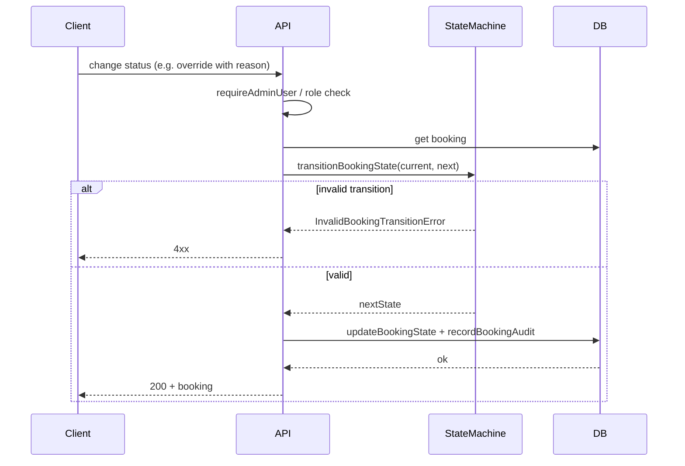

# TA-4 — Booking Lifecycle

**Status:** Target Architecture (flow control)  
**Scope:** Booking states, allowed transitions, who can perform them (instructor vs admin override), and how overrides are audited.

---

## Scope

- **In scope:** Booking create (e.g. from conversation/AI), confirm, reschedule (if supported), cancel, expire; admin override with reason; invalid transitions; audit trail.
- **Out of scope:** Payment or calendar sync side-effects; detailed UI flows (refer to implementation).

---

## Actors

| Actor | Role |
|-------|------|
| **Instructor / Admin UI** | Initiates confirm, cancel, or (admin) override. |
| **API / Edge Functions** | Validate transition, persist state, record audit. |
| **DB** | bookings (status), booking_lifecycle / audit (events with actor, previousState, newState). |
| **State machine (packages/db)** | transitionBookingState enforces allowed transitions; throws InvalidBookingTransitionError otherwise. |

---

## Trigger

- User (instructor or admin) requests a status change: confirm, cancel, expire, or admin override.
- System may create booking (e.g. proposed/draft) from conversation flow; state changes then follow transition rules.

---

## Happy Path (flusso principale)

**Transition rules (authoritative):**

- **draft** → proposed  
- **proposed** → confirmed | expired  
- **confirmed** → cancelled  
- **cancelled** | **expired** → (no outgoing transitions)

**Instructor flow (e.g. confirm/cancel):**

1. Request with valid JWT; userId from token.
2. Load booking; check ownership or permission (instructor_id).
3. Call transitionBookingState(currentState, nextState); if invalid → InvalidBookingTransitionError → 4xx.
4. updateBookingState(bookingId, newState); record audit (actor as appropriate).
5. Return success.

**Admin override:**

1. POST /admin/bookings/:id/override-status with { newStatus, reason? }; requireAdminUser → userId.
2. adminOverrideBookingStatus: assertRoleAllowed(userId, ['system_admin', 'human_approver']); load booking; transitionBookingState(previous, newStatus); updateBookingState; recordBookingAudit(actor='human', previousState, newState).
3. Return updated booking or throw BookingNotFoundError / InvalidBookingTransitionError.

---

## Variants

- **Create:** Booking may be created in draft or proposed from AI/conversation flow; creation is outside this lifecycle doc (see TA-3 / product flow).
- **Reschedule:** If supported, may be a separate transition or update to date/time; same principle: validate, persist, audit.
- **Admin override vs normal:** Normal transitions may be restricted to instructor; admin override is explicit, with reason, and recorded with actor='human'.

---

## Failure Modes

| Case | What happens | Guarantee |
|------|----------------|-----------|
| Invalid transition (e.g. cancelled → confirmed) | transitionBookingState throws InvalidBookingTransitionError | No state change; 4xx. |
| Booking not found | BookingNotFoundError | No write. |
| User not admin / role not allowed (override) | assertAdminAccess or assertRoleAllowed throws | No override. |
| Missing reason (if required by policy) | Document in implementation; may 4xx or allow | Audit still records actor and states. |

---

## Invariants

- **All transitions go through state machine.** No direct status update that bypasses transitionBookingState.
- **Admin override is audited.** recordBookingAudit with actor='human' and previous/new state.
- **Terminal states:** cancelled and expired have no outgoing transitions.

---

## Source of Truth

- **Allowed transitions:** packages/db/src/booking_state_machine.ts (transitionBookingState).
- **Current booking state:** DB table bookings (status column).
- **Audit / lifecycle:** DB (booking_audit or lifecycle events); CM-2.5 where applicable.

---

## Diagram (Mermaid)

---

## Links

- [TA-2 — Authorization & Roles](TA-2_AUTHORIZATION_AND_ROLES.md) (admin and role checks)
- [TA-5 — Admin Operations](TA-5_ADMIN_OPERATIONS.md) (override endpoint and audit)
- [CM-2.5 — Audit Trail](CM-2.5_AUDIT_TRAIL.md)
- [ARCHITECTURE_MIN](ARCHITECTURE_MIN.md) (booking state machine overview)
- Implementation: packages/db/src/booking_state_machine.ts, admin_booking_service.ts, booking_audit; apps/api/src/routes/admin.ts (POST override-status).
