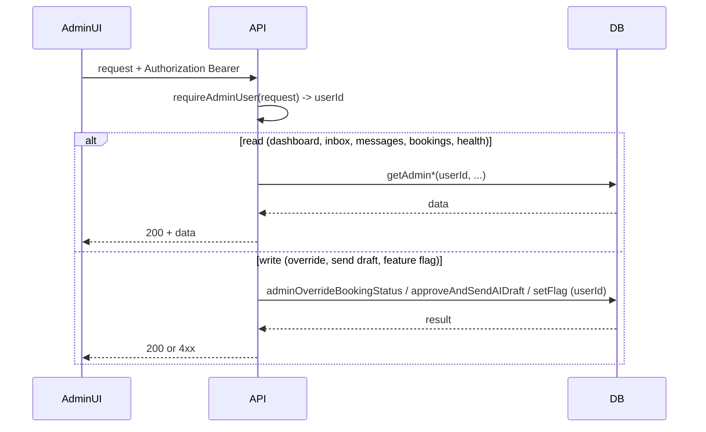

# TA-5 — Admin Operations

**Status:** Target Architecture (flow control)  
**Scope:** What admins can do: read (dashboard, inbox, messages, bookings, KPIs, system health) and write/override (booking status override, send AI draft, feature flags, outbound). How identity and audit apply.

---

## Scope

- **In scope:** Dashboard, human inbox, conversation/message review, booking list and detail, AI draft approve and send, manual outbound, feature flags read/write, system health and degradation; read vs write; override vs normal flow; audit where applicable.
- **Out of scope:** Instructor-only operations; WhatsApp webhook ingestion (TA-3); booking state machine rules (TA-4).

---

## Actors

| Actor | Role |
|-------|------|
| **Admin UI** | Web (Vite) or Admin app (Next.js). All requests carry `Authorization: Bearer <token>`. |
| **API (admin routes)** | Every route calls `requireAdminUser(request)`; userId only from JWT; passes userId to DB layer for scope and audit. |
| **DB** | conversations, messages, bookings, human_inbox views, feature_flags, audit/lifecycle tables. |

---

## Trigger

- Admin opens dashboard, inbox, or detail view (read).
- Admin performs an action: override booking status, approve/send AI draft, set feature flag, send manual message (write).

---

## Happy Path (flusso principale)

**Read (all admin GET):**

1. Request with Bearer token.
2. API: `requireAdminUser(request)` → userId.
3. API calls DB layer with that userId (e.g. getAdminConversations({ userId, limit, offset, ... })). DB layer may assert admin again (assertAdminAccess) or filter by permission.
4. Response: 200 + data.

**Write — Booking override:**

1. POST /admin/bookings/:id/override-status with body { newStatus, reason? }.
2. requireAdminUser → userId; adminOverrideBookingStatus(bookingId, newStatus, reason, userId). Transition and reason recorded (audit/lifecycle).
3. Response: 200 + result or 4xx on invalid transition/not found.

**Write — Send AI draft:**

1. POST /admin/conversations/:conversationId/send-ai-draft.
2. requireAdminUser → userId; approveAndSendAIDraft(conversationId, userId); then resolve target phone and send via WhatsApp API.
3. Response: 200 + message_id or 404 (draft/target not found).

**Write — Feature flags:**

1. GET/POST feature-flag endpoints; requireAdminUser; get/set flag with userId for audit or scope.
2. On error (e.g. invalid env): 4xx; no change to flag.

---

## Variants

- **Override vs normal flow:** Normal booking transitions may be done by instructor (TA-4); admin override is explicit (with reason) and recorded.
- **Read-only vs mutation:** All reads use same auth; mutations (override, send draft, set flag) are explicit and, where implemented, audited (CM-2.5).
- **System degradation:** Admin can read degradation signals (GET /admin/system-degradation) to see failure state; no write in that flow.

---

## Failure Modes

| Case | What happens | Guarantee |
|------|----------------|-----------|
| Not admin (token valid but isAdmin false) | requireAdminUser throws → 401 | No data returned; no write. |
| Missing or invalid token | 401 (TA-1) | No access. |
| Invalid transition on booking override | adminOverrideBookingStatus throws (InvalidBookingTransitionError) → 4xx | No state change. |
| Draft not found on send | 404 | No WhatsApp send. |
| Target phone not resolved | 404 / error | No send to wrong target. |
| Feature flag service error | 4xx/5xx per implementation | Document behaviour in implementation; avoid silent fallback. |

---

## Invariants

- **Admin only:** Every admin route enforces `requireAdminUser`; no use of client-provided userId for authorization (TA-1, TA-2).
- **Override is explicit:** Booking override includes reason where required; recorded in lifecycle/audit (CM-2.5).
- **Read vs write:** Reads return current state; writes are explicit actions (override, send, set flag) and audited where applicable.

---

## Source of Truth

- **Identity and role:** JWT (Supabase Auth) + DB (profiles/users) — TA-1, TA-2.
- **Conversations, messages, bookings:** DB (admin services read/write with admin userId).
- **Audit / lifecycle:** DB (booking lifecycle, audit events per CM-2.5 where implemented).

---

## Diagram (Mermaid)

---

## Links

- [TA-1 — Identity & Auth Flow](TA-1_IDENTITY_AND_AUTH.md)
- [TA-2 — Authorization & Roles](TA-2_AUTHORIZATION_AND_ROLES.md)
- [CM-2.5 — Audit Trail](CM-2.5_AUDIT_TRAIL.md)
- [ADMIN_BACKEND_FROZEN](ADMIN_BACKEND_FROZEN.md) (if applicable)
- Implementation: `apps/api/src/routes/admin.ts` and sub-routes under `admin/` (human_inbox, booking_lifecycle, send_ai_draft, feature_flags, system_degradation, etc.); all use `requireAdminUser`.
