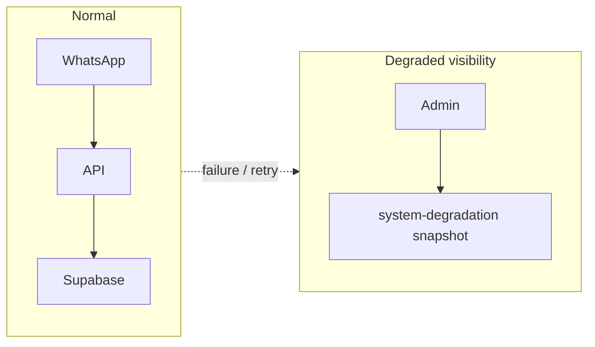

# TA-6 — Failure & Degradation Modes

**Status:** Target Architecture (flow control)  
**Scope:** What happens when things go wrong: observable behaviour, guarantees (what does NOT happen), and how the system recovers. Investor- and auditor-grade.

---

## Scope

- **In scope:** Supabase down, WhatsApp webhook failure, AI disabled or failing, partial ingestion, duplicate events. For each: what happens, what does NOT happen, how to recover.
- **Out of scope:** Detailed runbooks or SLA numbers; implementation-specific error codes (reference only where needed).

---

## Actors

Same as in TA-1, TA-3, TA-5: Browser, API, Supabase (Auth + DB), WhatsApp, AI/orchestration. This doc views them under failure conditions.

---

## Trigger

- External or internal failure: Supabase unreachable, webhook error, AI timeout/disabled, partial write, duplicate delivery.

---

## Failure Modes (per case)

### Supabase down (Auth or DB)

| | |
|--|--|
| **What happens** | Auth: `getUser(token)` fails → API returns 401. Role: if DB unreachable, `isAdmin(userId)` catches error and returns false → 403 (fail-closed). |
| **What does NOT happen** | No 500 “leaking” admin data; no successful request with stale or client-provided identity. |
| **Recovery** | Restore Supabase; clients retry login/session refresh. No local bypass of auth. |

### WhatsApp webhook down or API error

| | |
|--|--|
| **What happens** | If API returns 5xx (e.g. DB error during webhook handling), WhatsApp retries (provider policy, typically 3x). If API returns 4xx (bad payload), WhatsApp may stop or retry depending on provider. |
| **What does NOT happen** | Duplicate messages do not create duplicate rows: persist is idempotent on `external_message_id` (TA-3). Same webhook delivered twice → same conversation/message state. |
| **Recovery** | Fix API/DB; next retry succeeds. Idempotency allows safe retries. |

### AI disabled or draft orchestration failure

| | |
|--|--|
| **What happens** | Webhook still persists the inbound message. `orchestrateInboundDraft` may be skipped (gating) or throw; on throw, webhook catches, logs, and returns 200. No draft generated. |
| **What does NOT happen** | Message is not dropped. No autonomous send. |
| **Recovery** | Re-run draft for conversation if needed; or human writes reply (TA-5). |

### Partial ingestion (e.g. persist ok, draft fails)

| | |
|--|--|
| **What happens** | Message is stored first; then orchestration runs. If orchestration fails, message remains; response 200 so WhatsApp does not retry. |
| **What does NOT happen** | No “half message” (persist is atomic). No duplicate message from same webhook (idempotent). |
| **Recovery** | Message is in DB; admin can trigger or manual draft later; no data loss. |

### Duplicate events (same webhook delivered twice)

| | |
|--|--|
| **What happens** | Second request hits same `external_message_id`; persist layer does not insert duplicate (idempotent); orchestration may skip or no-op if already processed. |
| **What does NOT happen** | No duplicate rows for same inbound message; no double draft or double side-effect. |
| **Recovery** | None needed; system remains consistent. |

---

## Observability and admin

- **System degradation read model:** GET /admin/system-degradation (admin only) returns a snapshot: webhook inbound/errors (24h), AI draft stats, quota exceeded, escalations. Use for “what is degraded” rather than for recovery itself.
- **Recovery actions:** Fix underlying service (Supabase, API, AI); rely on idempotency for safe retries; use admin inbox and manual send for conversations where draft failed (TA-5).

---

## Invariants (under failure)

- **Auth/role fail closed:** If Supabase Auth or DB role check fails, treat as unauthenticated or not allowed (401/403), never 200 with elevated access.
- **Idempotency on ingestion:** Same `external_message_id` never creates duplicate message rows (TA-3).
- **Message before draft:** Inbound message is persisted before draft orchestration; draft failure does not lose the message.

---

## Source of Truth

- **Behaviour under failure:** This doc and TA-1, TA-3, TA-5. Implementation: webhook_whatsapp (idempotent persist, catch orchestration); auth_instructor + admin_access (fail-closed); system_degradation_service (read model).
- **Recovery:** Operational (restore services, retry); no automated “healing” beyond retries and idempotency.

---

## Diagram (Mermaid)

Optional: degradation as a simple state view. Flows under failure are already covered in TA-1, TA-3; this diagram summarizes visibility.

---

## Links

- [TA-1 — Identity & Auth](TA-1_IDENTITY_AND_AUTH.md) (auth failure → 401; no trust of client).
- [TA-3 — Conversation Lifecycle](TA-3_CONVERSATION_LIFECYCLE.md) (idempotency, message then draft).
- [TA-5 — Admin Operations](TA-5_ADMIN_OPERATIONS.md) (admin read degradation, manual send).
- [ARCHITECTURE_MIN](ARCHITECTURE_MIN.md) (Failure Modes & Recovery section).
- Implementation: apps/api/src/routes/webhook_whatsapp.ts (idempotent persist, catch orchestration); apps/api/src/lib/auth_instructor.ts; packages/db/src/admin_access.ts (isAdmin catch → false); packages/db/src/system_degradation_service.ts; apps/api/src/routes/admin/system_degradation.ts.
